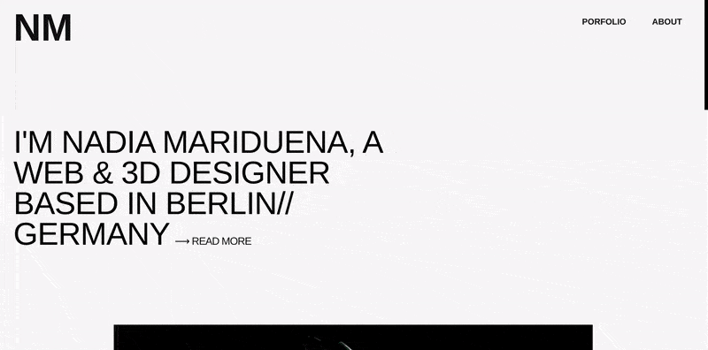

# This are my two Final projects for Digital Career Institute (DCI)

##### NADIA MARIDUENA portfolio

[nadia mariduena portfolio ](https://nadiamariduena.github.io/nm-final-funkythree/)

- Software | languages | libraries used:
  > Blender, React , javascript , Node, Threejs , Html, css/scss, Photoshop.

 
 

##### MELISSA MURILLO portfolio

[melissa murillo portfolio ](https://meyoko-2020-160ps5y8v.vercel.app/Home)

- Software | languages | libraries used:

  > React , javascript , Node, Threejs , Html, css/scss, Aos, Photoshop/illustrator.

   

  

 
 
 

## All the links below are the prototypes I created to build my two final projects.

- Few of the things I learned during the last two months like for example: **React Vr**, aren't used in my final projects, but its important to mention that I considered to use them for this purpose, so included them in this list.

 

#### All the prototypes related to the final project

   

_(private)_
[ NM PORTFOLIO "FINAL" ](https://github.com/nadiamariduena/nm-final)

[Testing the menu dropdown and the skew scroll](https://github.com/nadiamariduena/menu-hirstory-and-scroll-skew-test)

[portfolio ak menu gsap test | {history} use (Menu only)](https://github.com/nadiamariduena/nm-port-menu-ak-test)

_(private)_
[NM portfolio](https://github.com/nadiamariduena/nadiamariduena-portfolio-with-react-createapp)

_(private)_
[GSAP / three.js animations for nm portfolio ](https://github.com/nadiamariduena/nadiamariduena-portfolio)

 
 
 

#### THREEjs

[THREEjs | all the animation options for the nm portfolio](https://github.com/nadiamariduena/three-js)

 
 
 

_(private)_
[Personal website meyoko final 2020 ](https://github.com/nadiamariduena/final-project)

_(private)_
[ react npx service worker test ](https://github.com/nadiamariduena/npx-serviceworker-test)

 

_(private)_
[testing-scroll-skew1](https://github.com/nadiamariduena/testing-scroll-skew1)

_(private)_
[testing-scroll-skew2](https://github.com/nadiamariduena/testing-scroll-skew2)

_(private)_
[testing-scroll-skew3](https://github.com/nadiamariduena/testing-scroll-skew3)

 

[test-responsive1](https://github.com/nadiamariduena/test-responsive1)

_(private)_
[test-responsive2 | cube and flag](https://github.com/nadiamariduena/test-responsive2)

  

 
 

#### React VR (REACT NATIVE)

[React 360 _Hello_ Virtual Reality (introduction)](https://github.com/nadiamariduena/react-vr-intro1)

[ReactVR intro 2 (images) | VERCEL video install ](https://github.com/nadiamariduena/react-vr-intro2-images)

[ReactVR intro 3 (video)](https://github.com/nadiamariduena/react-vr-intro3-video)

[ReactVR intro 4 (importing 3D models)](https://github.com/nadiamariduena/react-vr-intro4-3dModels)

 
 

#### Animations

[smooth-skew-scrolling](https://github.com/nadiamariduena/react-smooth-skew-scrolling)

[threejs cube and flag (zoom in and zoom out) | 100% RESPONSIVE](https://github.com/nadiamariduena/three-js/tree/master/three_responsive_scenes)

[3dflag-threejs](https://github.com/nadiamariduena/3dflag-threejs-react)

[image reveal](https://github.com/nadiamariduena/react-imgreveal-mini-portfolio1)

[image reveal gsap](https://github.com/nadiamariduena/react-img-reveal1-gsap)

[animated-portfolio-with-intersection-observer](https://github.com/nadiamariduena/animated-portfolio-with-intersection-observer)

[animated-portfolio-with-aos](https://github.com/nadiamariduena/animated-portfolio-with-aos)

[animation-effects-onpage-scroll AOS](https://github.com/nadiamariduena/animation-effects-onpage-scroll)

[Navigation-hide-show-onscroll](https://github.com/nadiamariduena/react-hide-show-onscroll)

 
 
